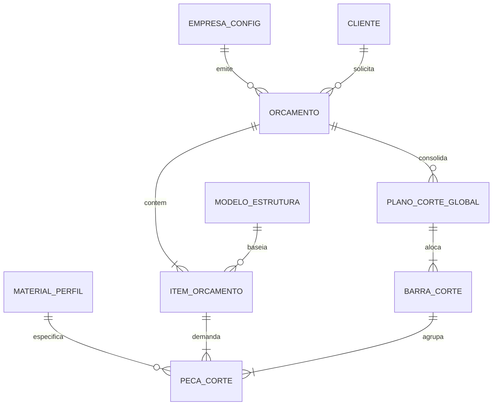
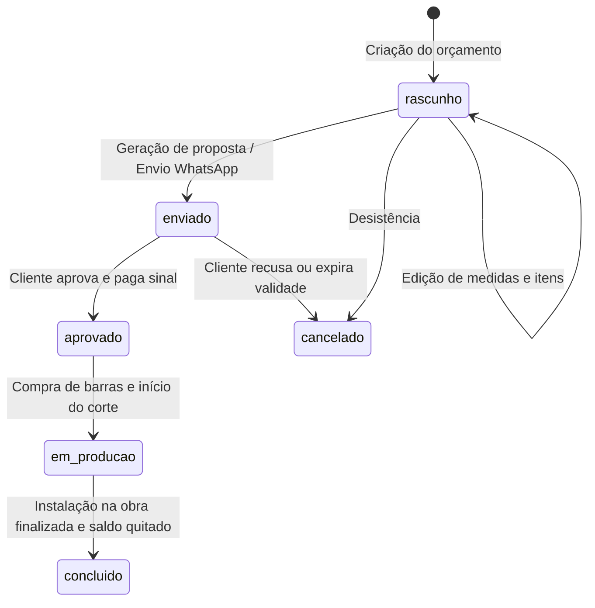

# Data Model: Sistema de Geração de Orçamentos para Serralheria

**Feature Branch**: `001-orcamento-serralheria`  
**Date**: 2026-09-14  
**Spec Reference**: [spec.md](./spec.md) | **Research Reference**: [research.md](./research.md)

---

## 1. Diagrama Entidade-Relacionamento



---

## 2. Especificação das Entidades e Interfaces TypeScript

### 2.1 `EmpresaConfig` (Configurações da Oficina)
Representa a oficina de serralheria, definindo a identidade visual na proposta e as taxas base de custos.
```typescript
export interface EmpresaConfig {
  id: string; // 'default'
  nomeFantasia: string;
  razaoSocial?: string;
  documento: string; // CNPJ ou CPF
  telefoneWhatsApp: string;
  email?: string;
  endereco: string;
  cidadeUf: string;
  logoUrl?: string; // Data URL Base64 ou URL local
  chavePix: string;
  tipoChavePix: 'cpf' | 'cnpj' | 'celular' | 'email' | 'aleatoria';
  taxaHoraOficina: number; // Ex: R$ 45.00/h
  taxaHoraInstalacao: number; // Ex: R$ 55.00/h
  margemLucroPadrao: number; // Ex: 40 (%)
  validadeDiasPadrao: number; // Ex: 10 dias
  garantiaMesesPadrao: number; // Ex: 12 meses
  termosCondicoesPadrao: string;
}
```

### 2.2 `Cliente`
Cadastro do tomador do serviço ou contratante da obra.
```typescript
export interface Cliente {
  id: string; // UUID v4
  nome: string;
  telefoneWhatsApp: string;
  email?: string;
  documento?: string; // CPF ou CNPJ
  enderecoObra: {
    logradouro: string;
    numero: string;
    bairro: string;
    cidade: string;
    uf: string;
    cep?: string;
    pontoReferencia?: string;
  };
  observacoesAcesso?: string; // Ex: 'Portão estreito, instalação no 3º andar'
  dataCadastro: string; // ISO 8601
  dataAtualizacao: string; // ISO 8601
}
```

### 2.3 `MaterialPerfil` (Catálogo de Aço e Barras de 6m)
Especifica perfis metálicos adquiridos em barras padronizadas de 6 metros.
```typescript
export interface MaterialPerfil {
  id: string; // Ex: 'metalon-50-30-ch18'
  codigo: string; // Ex: 'MT-5030-18'
  descricao: string; // Ex: 'Metalon 50x30 Chapa 18 (1.20mm)'
  tipo: 'tubo_retangular' | 'tubo_quadrado' | 'tubo_redondo' | 'cantoneira' | 'barra_chata' | 'perfil_u' | 'ferro_t';
  dimensoesMm: {
    largura: number; // Ex: 50
    altura: number; // Ex: 30
    espessuraChapaMm: number; // Ex: 1.20 (Chapa 18)
  };
  comprimentoBarraMm: number; // Sempre 6000 (6,00 metros)
  pesoNominalKgPorBarra: number; // Ex: 8.82 kg
  precoBarra6m: number; // Ex: R$ 78.50
  ativo: boolean;
}
```

### 2.4 `InsumoConsumivel` & `AcessorioItem`
Insumos de solda, acabamento e componentes de terceiros.
```typescript
export interface InsumoConsumivel {
  id: string;
  descricao: string; // Ex: 'Eletrodo OK 46 E6013 2.5mm'
  unidade: 'kg' | 'unidade' | 'lata_3.6L' | 'disco';
  custoUnitario: number;
}

export interface AcessorioItem {
  id: string;
  descricao: string; // Ex: 'Fechadura Bico de Papagaio Tetra Stam'
  quantidade: number;
  custoUnitario: number;
  precoVendaUnitario?: number;
}
```

### 2.5 `ItemOrcamento` (Estrutura ou Serviço Orçado)
Cada produto individual pertencente a uma proposta comercial.
```typescript
export interface PecaLinearDemanda {
  id: string;
  descricao: string; // Ex: 'Montante lateral esquerdo'
  perfilId: string;
  comprimentoMm: number; // Ex: 2200
  quantidade: number; // Ex: 2
}

export interface ItemOrcamento {
  id: string; // UUID
  orcamentoId: string;
  descricao: string; // Ex: 'Portão Basculante com Social Embutido'
  tipoEstrutura: 'portao_basculante' | 'portao_deslizante' | 'grade_tubo' | 'grade_tela' | 'corrimao' | 'guarda_corpo' | 'cobertura' | 'personalizado';
  medidas: {
    larguraM: number; // Ex: 3.00
    alturaM: number; // Ex: 2.20
    profundidadeM?: number;
  };
  quantidadeUnidades: number; // Ex: 1
  acabamento: string; // Ex: 'Pintura primer anticorrosivo cinza zarcão'
  pecasDemandadas: PecaLinearDemanda[];
  acessorios: AcessorioItem[];
  horasFabricacao: number; // Ex: 14h
  horasInstalacao: number; // Ex: 4h
  ajustesManuais?: {
    custoMaterialManual?: number;
    custoMaoDeObraManual?: number;
    subtotalManual?: number;
  };
  subtotalCustoDireto: number;
  subtotalPrecoVenda: number;
}
```

### 2.6 `PlanoCorteGlobal` & `BarraCorte` (Resultado do Otimizador 1D)
Estrutura gerada pelo algoritmo First-Fit Decreasing unificando os perfis do orçamento.
```typescript
export interface PecaAlocadaNaBarra {
  pecaId: string;
  itemOrigemId: string;
  itemDescricao: string;
  descricaoPeca: string;
  tamanhoMm: number;
  posicaoInicioMm: number;
  posicaoFimMm: number;
}

export interface BarraCorte {
  id: string;
  numeroBarra: number;
  comprimentoTotalMm: number; // 6000
  espacoUtilizadoMm: number;
  sobraMm: number;
  aproveitavel: boolean; // true se sobra >= 1000mm
  pecas: PecaAlocadaNaBarra[];
}

export interface PlanoCortePorPerfil {
  perfilId: string;
  descricaoPerfil: string;
  precoUnitarioBarra: number;
  totalPecas: number;
  comprimentoLinearTotalMm: number;
  totalBarras6mNecessarias: number;
  custoTotalPerfil: number;
  aproveitamentoPercentual: number; // (utilizado / total_barras) * 100
  barras: BarraCorte[];
  retalhosAproveitaveisMm: number[];
}
```

### 2.7 `Orcamento` (Entidade Raiz do Negócio)
Representa a cotação comercial completa.
```typescript
export type StatusOrcamento = 'rascunho' | 'enviado' | 'aprovado' | 'em_producao' | 'concluido' | 'cancelado';

export interface CondicoesPagamento {
  tipo: 'a_vista_pix' | 'sinal_mais_saldo' | 'parcelado_cartao';
  percentualSinal?: number; // Ex: 50 (%)
  valorSinal?: number; // Ex: R$ 2.500,00
  valorSaldoEntrega?: number; // Ex: R$ 2.500,00
  numeroParcelas?: number; // Ex: 12
  valorParcela?: number;
  descricaoDetalhada: string;
}

export interface Orcamento {
  id: string; // UUID v4
  numeroSequencial: number; // Ex: 101, 102...
  dataCriacao: string; // ISO 8601
  dataAtualizacao: string; // ISO 8601
  validadeDias: number; // Ex: 10
  status: StatusOrcamento;
  clienteId: string;
  clienteSnapshot: Cliente; // Cópia para histórico imutável
  itens: ItemOrcamento[];
  planoCorteConsolidado: PlanoCortePorPerfil[];
  
  // Custos Diretos
  custoAcoTotal: number;
  custoInsumosTotal: number;
  custoAcessoriosTotal: number;
  custoMaoDeObraTotal: number;
  custoFrete: number;
  outrosCustos: number;
  custoDiretoTotal: number; // Soma de todos os custos acima
  
  // Precificação e Fechamento
  margemLucroPercentual: number; // Ex: 40 (%)
  metodoMargem: 'sobre_receita' | 'sobre_custo';
  valorLucroEstimado: number;
  precoVendaBruto: number;
  descontoPercentual: number;
  descontoValor: number;
  precoVendaFinal: number; // Preço a ser cobrado do cliente
  
  // Comercial
  condicoesPagamento: CondicoesPagamento;
  prazoEntregaDiasUteis: number; // Ex: 15
  garantiaMeses: number; // Ex: 12
  observacoesGerais?: string;
  
  // Proposta Comercial
  textoWhatsAppFormatado: string;
}
```

---

## 3. Regras de Transição de Estado do Orçamento


